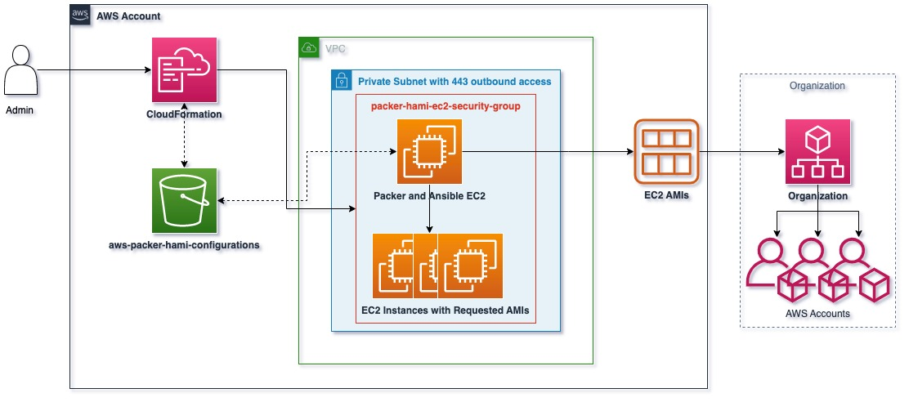

# aws-packer-ansible-hami-pipeline
This repo provides resources for creating AWS AMIs using HashiCorp Packer with the Ansible Core plugin to do optional CIS Hardening using [Ansible Lockdown playbooks](https://github.com/ansible-lockdown/). Resources are deployed using AWS CloudFormation, configuration is stored in an S3 bucket, and execution is done via User Data on an EC2.

This repository is for educational/example purposes only and should be vetted (Specifically, any CIS hardening automation via 3rd party tools) before use in any production environment. 

# How it works

1. Administrator deploys a CloudFormation stack from either the aws-packer-hami-configurations bucket or through a local upload.
2. CloudFormation creates:  
    1. An EC2 Instance with user_data to download and install:  
        * Packer.  
        * Ansible.
        * Related libraries from Yum, Pip, and GitHub.
        * Packer configurations from an S3 bucket.  
    2. A packer-hami-ec2 security group to allow:
        * 22/SSH within the Security Group.
        * 443/https outbound.
    3. An IAM role and instance profile with required permissions to deploy EC2 instances, attach security groups, create AMIs, and other related permissions.

Once the Packer & Ansible EC2 instance has downloaded, installed, and configured required components:
1. Packer is executed by the "$ packer init .; packer build ." commands.
2. For each {os_flavour}.pkr.hcl in the packer_config.zip  that reside in the S3 bucket:
    1. Packer creates an EC2 instance and attaches the created instance profile and security group to the instance within the same VPC and subnet.
    2. Packer SSHs (if needed) into the Instance and executes and specified commands on the instance.
    3. An AMI is created for each of the OS flavours that have a configuration pkr.hcl file.
3. Packer shares the AMIs with the Organization and the regions allowed.

# Implementation & Use
First, configure and update the configuration files and re-upload, if needed:
1. Adjust variables in the variables.pkr.hcl as needed. Expected ones to need any change, if at all:
    * ami_deployment_regions . Variable to control regions AMIs are shared to.
    * region . Region where are EC2 instances are deployed. Should match region the ec2.yml  CF template is executed in along with the VPC and subnet regions.
    * subnet_id . Private subnet that has 443 outbound connectivity to allow SSM and other internet actions.
    * vpc_id . VPC parent of above private subnet.
    * wxyz_playbook . Path for Ansible CIS hardening playbooks. New playbooks will need to be created for new AMIs you want hardened.
2. Add any new cis_1_{os_flavour}_ami_pipeline_hardened.pkr.hcl files (CIS 1 hardened) or {os_flavour}_ami_pipeline.pkr.hcld files (non-hardened) if you want to publish a new AMI type.
3. Adjust existing {os_flavour}pkr.hcl files as needed:
    * deprecate_at parameter should but updated to be 120 days from date of AMI creation (to allow 90 days between new AMI releases and 30 days for application teams to migrate)
    * build{} field can be used to run Bash/Powershell/etc commands or custom Packer provisioners on these AMIs before baking.
 
Secondly, configure and update the CloudFormation template and reupload, if needed:
1. Download .yml.
2. Update default parameters where needed (need to match Packer variables.pkr.hcl).
3. Update the EC2 user_data script to include any new downloads, installs, or configuration changes needed.
4. Update any other field as needed (unlikely).
 
Finally, deploy the stack:
1. Navigate to configured region (default: us-west-2)
2. Navigate to CloudFormation console page and click "Deploy stack".
3. Create a stack using the template.
4. All values should be pre-populated. 
    * See Dependencies below.
5. Click deploy.
    * Ensure you are signed into a role or pass a role with sufficient privileges to deploy.
    * See the above section labeled "Process" for what the CloudFormation deploys.
 
Assuming the stack deploys successfully and VPC and Subnet configurations are correct and allow internet, the EC2 instance that was deployed will begin creating AMIs and sharing them with the organization and regions defined in the variables.pkr.hcl.
 
Once the AMIs are created and viewable in the regions and accounts under EC2 Console → AMIs → Shared With Me and/or Owned By me (depending on what account you're viewing it in) you can then delete the CloudFormation Stack until you need to build another AMI.
 
In 90 days, re-deploy the stack. Alternatively, pause the instance until needed again and re-run the commands:
1. `sudo runuser -l ec2-user -c '/bin/packer init /tmp/packer/.'; `       
2.  `sudo runuser -l ec2-user -c '/bin/packer build /tmp/packer/.';` 
    * From within the instance as root as well as any configuration changes to needed files prior.

# Debug:
1. Check the log of your user data script in:
    * `/var/log/cloud-init.log` and
    * `/var/log/cloud-init-output.log`
2. If the pipeline doesn't fail and doesn't create an AMI - ensure that the "create_amis" variables in variables.pkr.hcl inside of packer_config.zip is set to False.

# Dependencies:
1. Packer and Ansible (Plus their requirements; e.g., Python 3)
2. Ansible Lockdown:
    * https://github.com/ansible-lockdown/AMAZON2-CIS
3. VPC and private subnet with ability to 443 outbound.
4. An S3 bucket to hold Packer pkr.hcl configuration files.

If Ansible Lockdown is not used, CIS Workbench premium has CIS hardening scripts.